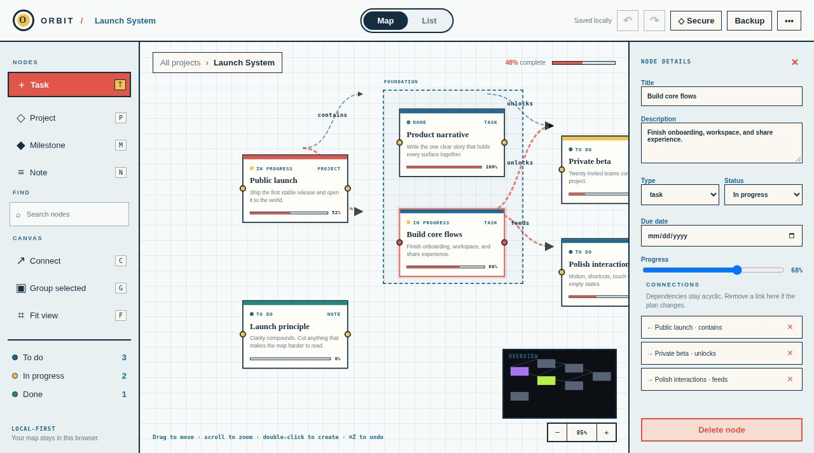

# Orbit

A local-first graph canvas for managing projects.



**Live:** https://aeiouvcode.github.io/orbit-graph/

## About

Plan work as a graph. Add tasks, projects, milestones and notes, connect them as dependencies (kept acyclic), group them, and track status and progress. Switch between the map and a list, find nodes, undo and redo, and import or export JSON.

Maps can be encrypted in the browser with a passphrase (PBKDF2-SHA-256, AES-256-GCM; the key is never stored). A strict Content Security Policy blocks outbound requests. No build step.

## Shortcuts

`T` task · `P` project · `M` milestone · `N` note · `C` connect · `G` group · `F` fit view · `⌘Z` undo

## Run locally

```sh
git clone https://github.com/aeiouvcode/orbit-graph.git
cd orbit-graph
python3 -m http.server 8000
```

Then open http://localhost:8000.

Tests: `node tests.mjs`.

## Layout

```
index.html    app shell
app.js        canvas, graph and storage
style.css     styles
tests.mjs     tests
SECURITY.md   security notes
docs/         README assets
```
